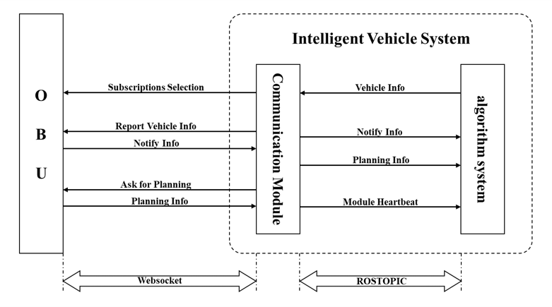
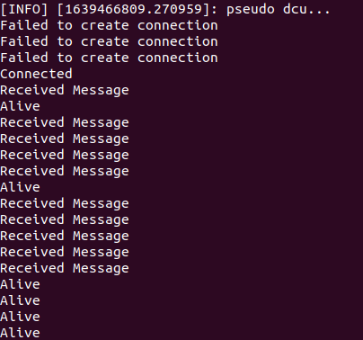

# Communication between OBU & DCU

This repository is for the communication between OBU & DCU, which is a simple V2X application. The architecture of the formal version is shown below. The module will try to reconnect every 2s, if the websocket connection is failed.



## Environment
* ROS               Melodic
* python            2.7/3.6
* websocket-client  0.32.0
* websocket-server  0.4

## Setup
* Move the folder planning_msg to your ros_workspace
* Build the customized ROSMSG
    ```cpp
    // Keypoints ROSMSG
    string type
    float64 lat
    float64 lon
    int64 heading
    // Trail ROSMSG
    float64 lat
    float64 lon
    // Planning ROSMSG
    string ts
    string area_id
    string level
    string reason
    string dest
    string option
    string last_ret
    keypoints[] key_points
    trail[] trail
    ```

## OBU2DCU

### Usage
* Send the subscribe message from OBU to DCU via ROSTOPIC
* Listen to the PST and :
    * Save the received JSON to msg_log [Optional];
    * Transfer the JSON into the customized ROSMSG format;
    * Publish the ROSTOPIC for the received message, e.g. '/obu_planning' and '/obu_uwb';
    * Publish the heartbeat of the OBU2DCU at '/obu2dcu_status'.
        > Here is an example of the heartbeat, the status includes Alive(per 5s), Failed to create connection, Connected, and Received Message.

        > 

### How to use
* Set the parameters in [obu2dcu.py](./formal_version/obu2dcu/obu2dcu.py) line 13 - 15.

    ```python
    ADDR = "ws://localhost:8204"
    IS_SUBCRIBE_PLANNING = True
    IS_SAVING_LOG = False
    ```
* Run the code

    ```bash
    python obu2dcu.py
    ```

## DCU2OBU

### Usage
* Send the vehicle reports from DCU to OBU via websocket
* Listen to the DCU and:
    * Subscribe the ROSTOPIC reports at '/reports_to_obu'
    * Transfer ROS-MSG(String) into JSON format
    * Report the message to the OBU
    * Publish the heartbeat of the DCU2OBU at '/dcu2obu_status'

### How to use
* Set the parameter in [dcu2obu.py](./formal_version/dcu2obu/dcu2obu.py) line 6.

    ```python
    ADDR = "ws://localhost:8205"
    ```
* Run the code

    ```bash
    python dcu2obu.py
    ```

## How to debug

In addition, a debug version is also provided, including the pseudo OBU and DCU for debugging.

### Debug for OBU2DCU
* Setup the pseudo DCU, which could subcribe the ROSTOPIC published by the OBU2DCU, including the received OBU messages and the hearbeat of the OBU2DCU.

    ```bash
    python pseudo_dcu.py
    ```

* Setup the OBU2DCU.

    ```bash
    python obu2dcu.py
    ```

* Setup the pseudo OBU server, which will send the JSON files saved in [msg_log](./debug_version/obu2dcu/msg_log/).

    ```bash
    python pseudo_obu.py
    ```

### Debug for DCU2OBU

* Setup the heartbeat receiver, which could subscribe the heartbeat published by the DCU2PST.

    ```bash
    python pseudo_status_rcv.py
    ```

* Setup the DCU2OBU.

    ```bash
    python dcu2obu.py
    ```

* Setup the pseudo OBU server, which will listen to the port for receiving the reported messages.

    ```bash
    python pseudo_obu.py
    ```

* Setup the pseudo DCU, which will publish the ROSTOPIC and send the reports ROSMSG.

    ```bash
    python pseudo_dcu.py
    ```


    


